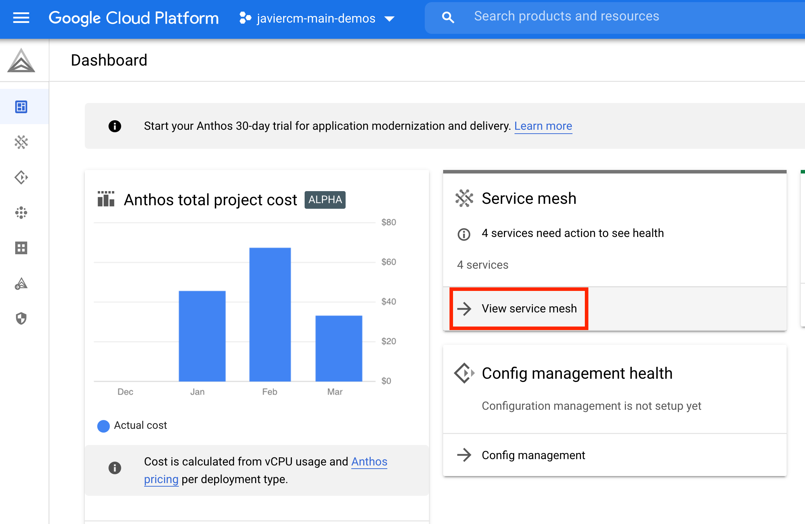

# Introduction

**Updated to ASM 1.10.4-14**

This repo contains all the necessary artifacts to go from zero to demo the latest version of Anthos Service Mesh, ASM 1.8.2.

`asm_gke` automates the deployment and destruction of a Anthos Service Mesh GKE enabled cluster in GCP. The script is designed to work witht the [ASM 1.8.x installation script](https://cloud.google.com/service-mesh/docs/scripted-install/reference) provided by Google Cloud.

The script is designed to work with GCP's Cloud Shell. You will need editor permissions on a GCP project and, if you're a googler, GCE enforcer disabled.

# Setting up the environment

Open Cloud Shell, and make sure your active project is the one you want to deploy everything in:

```bash
gcloud config set project <your project ID>
```

Once that's done, check the environment variables picked up by the script:

```bash
./asm_gke show-config
```

and when you're confidend everything looks alright run it:

```bash
./asm_gke install
```

That's it. You should have a cluster running with Anthos Service Mesh enabled on it and the sample Istio application [Bookinfo](https://istio.io/latest/docs/examples/bookinfo/) deployed.

## Getting help and options

Run:
```bash
./asm_gke --help
```

For step-by-step instructions on demoing ASM, read on.

## But I want to run this from my local machine
The script is not yet ready to deploy the istioclt binaries in your local machine, whatever your operating system may be. It's designed and teste only for Google Cloud Shell. However, you can get a close experience by connecting to Cloud Shell from your local shell using the GCP SDK.

For illustration purposes, let's say you have a Mac. Install Google Cloud SDK, so you have the gcloud tool installed in your system. Now, let's imagine you use iTerm2. Open a new shell session and do, authenticate gcloud with the Google account you'll be using in your GCP project and do:

```bash
gcloud cloud-shell ssh --authorize-session
```

Voilà, you now have a Cloud Shell session opened from your local terminal. If you also want to manipulate remote files with an IDE, say VSCode, you can also open a new local shell session and do:

```
# Creates a mount point for Cloud Shell filesystem
mkdir -p ~/cloudshell
# Gets the command to mount the Cloud Shell remote filesystem on cloudshell/ and executes it
$(cloud cloud-shell get-mount-command cloudshell)
# Now change to the mount point and open VSCode from there
cd cloudshell
code .
```

You have now your local IDE editing your remote files in Cloud Shell, so you can take advantage of whatever plugins or workflows you may have enabled in your IDE.

# Demoing ASM

The `asm_gke` script has deployed Istio's Bookinfo application for you. Read the [introduction at Istio's website](https://istio.io/latest/docs/examples/bookinfo/) to understand the basics of what you've just deployed. The application microservices architecture looks like this:


Having a polyglot application (with microservices written in different languages), although a reflection of real life, is typically a pain in the ass for a demoer to fully understand the deployment details in Kubernetes. But in this case, we're talking about demoing Istio and it's ability to abstract away implementation details (like security and communications in this case), so it's quite relevant to have it this way.

## Checking the deployment

Let's check what we've got deployed in the default namespace by getting the services:

```bash
kubectl get svc
```
```text
details       ClusterIP   10.3.249.116   <none>        9080/TCP   109m
kubernetes    ClusterIP   10.3.240.1     <none>        443/TCP    117m
productpage   ClusterIP   10.3.244.28    <none>        9080/TCP   109m
ratings       ClusterIP   10.3.241.215   <none>        9080/TCP   109m
reviews       ClusterIP   10.3.247.53    <none>        9080/TCP   109m
```

(If the previous command throws an authentication error because you're Cloud Shell VM stopped, just grab the cluster credentials again with `gcloud container clusters get-credentials gke-asm --zone europe-west1-b`)

Let's have a look at the pods that actually implement the service:

```bash
kubectl get pods
```
```text
NAME                              READY   STATUS    RESTARTS   AGE
details-v1-558b8b4b76-kg24c       2/2     Running   0          15h
productpage-v1-6987489c74-sd7xv   2/2     Running   0          15h
ratings-v1-7dc98c7588-dfr5w       2/2     Running   0          15h
reviews-v1-7f99cc4496-xcn2f       2/2     Running   0          15h
reviews-v2-7d79d5bd5d-x26ds       2/2     Running   0          15h
reviews-v3-7dbcdcbc56-twlh2       2/2     Running   0          15h
```

Each pod has two containers running, one for implementing the service logic and the other one for the ASM proxy sidecar that has been injected automatically when deploying the application. We can see that by inspecting any of the services and having a look a the `Containers` attribute:

```bash
kubectl describe pod productpage
```
```text
[...]
Containers:
  productpage:
    Container ID:   docker://b6929b11f06079328f9c379d2e54b9849245d232aab9d18c412d09fc4f58eda9
    Image:          docker.io/istio/examples-bookinfo-productpage-v1:1.16.2
[...]
  istio-proxy:
    Container ID:  docker://1b10430bf7f1576b77b6248876f88358253f8f879935356d27368828b42f1996
    Image:         gcr.io/gke-release/asm/proxyv2:1.8.3-asm.2
    Image ID:      docker-pullable://gcr.io/gke-release/asm/proxyv2@sha256:d3c55c913888d4d50d3f5e6f50461af14592327bc40078a67e6529ebc935bf0f
[...]
```

We can also test that a specific pod is under the service mesh by using `istioctl`:
```bash
./istio-1.8.3-asm.2/bin/istioctl x \
  describe pod $(kubectl get pods | awk '/productpage/ {print $1}')
```
```text
Pod: productpage-v1-6987489c74-cw22z
   Pod Ports: 9080 (productpage), 15090 (istio-proxy)
--------------------
Service: productpage
   Port: http 9080/HTTP targets pod port 9080


Exposed on Ingress Gateway http://35.195.98.104
VirtualService: bookinfo
   /productpage, /static*, /login, /logout, /api/v1/products*
```


Let's now test that we have a Gateway deployed that managing the traffic in our default workspace:
```bash
kubectl describe gateway
```
```text
[...]
Spec:
  Selector:
    Istio:  ingressgateway
[...]
```
 
 We can see that the gateway object is associated with the default Istio Ingress Gateway, that we can check in the `istio-system` namespace:

 ```bash
 kubectl describe svc istio-ingressgateway -n istio-system
 ```
 ```text
 [...]
 Type:                     LoadBalancer
IP Families:              <none>
IP:                       10.3.252.189
IPs:                      <none>
LoadBalancer Ingress:     35.195.98.104
[...]
```

Our external IP, exposed as a Load Balancer, is there as well. Let's save it into a shell variable and test that our application is responding to external HTTP requests:

```bash
source ./setenv
curl -I "$GW_URL"
```
```text
HTTP/1.1 200 OK
content-type: text/html; charset=utf-8
content-length: 4183
server: istio-envoy
[...]
```

Now copy the application URL in the clipboard:

```bash
echo "$GW_URL" | pbcopy
```

and paste (CMD + V) it into your browser address bar to load the BookInfo web page.

## An overview of the ASM dashboard

To see relevant information in the ASM dashboard, we need to generate some load. Let's do that with an application called `siege`. Because Cloud Shell VM is ephemeral, you'll need to install it first:

```bash
sudo apt install siege
```

and the use it to create traffic against your services:

```bash
siege $GW_URL &
```

### Evaluating service performance using ASM's dashboard

Now, go to [console.cloud.google.com] and 
- navigate to **Anthos>Dashboard**
- Click on **View Service Mesh**
  
- Observe the services listed in the **bottom half of the page, under the section named Services**
- Click on a specific service, **productpage**, to drill down and see more details. Note the summary at the top right detailing current requests/second, error rates, latencies, and resource usage.
- On the **left side menu**, click on **Metrics** option and review this page.
- On the **left side menu**, click on **Connected Services** option and review this page.
  - This lists other services that make inbound requests to the productpage, and other services the productpage service makes outbound requests to.
  - Click on the **INBOUND** and **OUTBOUND** tabs and note that all request go through mTLS
- Return to the **Main ASM dashboard** by clicking on the **ASM logo**.
- Click on **TOPOLOGY in the upper right corner** to view the mesh topology.
- **Rearrange the nodes in the graph** to easily visualize the relationships.


## Traffic Management

Our application has a gateway configuration artifact called `bookinfo-gateway` that controls the configuration of the Ingress Gateway. We've already explored its configuration, it just enables HTTP traffic over port 80.

Let's now explore the `VirtualService` used by Bookinfo to route traffic from the gateway:

```bash
kubectl get virtualservices
```

We can see that VirtualService is defined and a Gateway is attached to it. This has been put in place by the `asm_gke` script that you run during installation by performing a `kubectl apply -f bookinfo-gateway.yaml`. We can see the details of the service using `kubectl`:


```bash
kubectl describe virtualservices bookinfo
```
```text
Name:         bookinfo
Namespace:    default
Labels:       <none>
Annotations:  <none>
API Version:  networking.istio.io/v1beta1
Kind:         VirtualService
[...]
Spec:
  Gateways:
    bookinfo-gateway
  Hosts:
    *
  Http:
    Match:
      Uri:
        Exact:  /productpage
      Uri:
        Prefix:  /static
      Uri:
        Exact:  /login
      Uri:
        Exact:  /logout
      Uri:
        Prefix:  /api/v1/products
    Route:
      Destination:
        Host:  productpage
        Port:
          Number:  9080
Events:            <none>
```

Virtual services, along with destination rules, are the key building blocks of Istio’s traffic routing functionality that ASM is using. While Virtual Services define how you route traffic **to a given destination**, Destination Rules then let you configure what happens to the traffic **for that destination**. Destination rules are applied after Virtual service routing has been evaluated, so they actually appli to the traffic's real destination.

Let's see what destination Rules we've got in place:

```bash
kubectl get destinationrules
```
```text
No resources found in default namespace.
```

### Apply destination rules for all versions

Currently, **no destination rules exist** because the installation script didn't create any. Let's now define all the available versions, using the concept of subset, in destination rules.

The file we're going to be applying here is `artifacts/destination-rule-all.yaml`. **Edit it and have a look at its structure**:

```yaml
cat artifacts/destination-rule-all.yaml
```

Then, apply a config that defines 4 `DestinationRule` resources, 1 for each service (all are in the same file):

```bash
kubectl apply -f samples/bookinfo/networking/destination-rule-all.yaml
```
```text
destinationrule.networking.istio.io/productpage created
destinationrule.networking.istio.io/reviews created
destinationrule.networking.istio.io/ratings created
destinationrule.networking.istio.io/details created
Check that 4 DestinationRule resources were defined.
```

Then, let's test that our destination rules have been applied:

```bash
kubectl get destinationrules
```
```text
NAME          HOST          AGE
details       details       1m
productpage   productpage   1m
ratings       ratings       1m
reviews       reviews       1m
```

You can review the details of the destination rules by asking for the yaml:

```bash
kubectl get destinationrules -o yaml
```

**Notice that subsets are defined within the spec of a DestinationRule**.

Now wait for a couple of minutes and go back to the **Anthos Service Mesh console**. Select the **reviews** service and then select **Traffic** from the left menu. You should see that the traffic is evenly distributed into the three versions.

### Configure Virtual Services to use these Destination Rules

Let's now deploy new virtual services for each service that are going to route all traffic to just v1 of the services workload. First, have a look at the new virtual services we're just going to deploy:

```bash
cat artifacts/virtual-service-all-v1.yaml
```
```text
virtualservice.networking.istio.io/productpage created
virtualservice.networking.istio.io/reviews created
virtualservice.networking.istio.io/ratings created
virtualservice.networking.istio.io/details created
``` 

Check that 4 routes, VirtualService resources, were defined:

```bash
kubectl get virtualservices
```

Now test the new behavior. Go to the **Anthos Service Mesh console** and select the reviews service and then in the **left menu, select Traffic** If siege is still running, you should see the traffic statistics of, say, service reviews, to start being unbalanced towards the reviews-v1 service that has been tagged with v1 by the destinationrule. Play with the timeline so you can focus in the last two minutes to see more about the effect of the traffic change.

You can also check it by going to `http://GW_URL`, refreshing several times and noticing that **the Book Reviews part of the page displays with no rating stars**, no matter how many times you refresh. This is because you configured Istio to route all traffic for the reviews service to the version reviews:v1 and **this version of the service does not access the star ratings service**.

### Route to specific version of a service based on user identity

You can also change the route configuration so that all traffic from a specific user is routed to a specific service version. In this case, all traffic from user jason will be routed to the service reviews:v2, the version that includes the star ratings feature.

Note: Istio does not have any special, built-in understanding of user identity. This example is enabled by the fact that the productpage service adds a custom end-user header to all outbound HTTP requests to the reviews service.

Review the new VirtualService config:

```bash
more ./artifacts/virtual-service-reviews-test-v2.yaml
```
```text
apiVersion: networking.istio.io/v1alpha3
kind: VirtualService
metadata:
  name: reviews
spec:
  hosts:
    - reviews
  http:
  - match:
    - headers:
        end-user:
          exact: jason
    route:
    - destination:
        host: reviews
        subset: v2
  - route:
    - destination:
        host: reviews
        subset: v1
```

Apply the config that defines 1 VirtualService resource:

```bash
kubectl apply -f samples/bookinfo/networking/virtual-service-reviews-test-v2.yaml
```
```text
virtualservice.networking.istio.io/reviews configured
````

Confirm the rule is created:

```bash
kubectl get virtualservice reviews
```
```
NAME      GATEWAYS   HOSTS       AGE
reviews              [reviews]   35m
```

Now test the new routing configuration using the Bookinfo UI:
- Browse again to `/productpage` of the Bookinfo application.
- Click **Sign in**, and use User Name of jason with no password. Notice the UI shows stars from the rating service, which is the version of the service that shows stars.

You can sign out, and try signing in as other users. You will no longer see stars with reviews.

# Tearing down the environment
To tear down the environment and restore your project the way it was before running the script, run:

```bash
./asm_gke destroy
```

# Todos

- Include installation option to enable Anthos 1.9 Managed Control Plane instead of deploying it in the Kubernetes cluster
- Include gradual shift of traffic per service version.
- Add installation option to deploy a ASM-enable GCE VM, moving one of the bookinfo services there.
- Enable the script to work on Linux, Cloud Shell and Mac OS X (tooling for OS X
  in curl -OL https://github.com/istio/istio/releases/download/1.8.1/istioctl-1.8.1-osx.tar.gz)
- Enable workload identity and configure cluster labels in one call at cluster creation, it should be
  slightly faster than doing the steps atomically.
- Force install_asm to understan the specific version this script is requesting to install. By
  default, install_asm always sets the last ASM version, and version stickiness is achieved by
  bash variables instead of flags or argument. So, I should export here the corresponding vars
  MAJOR, MINOR, POINT and REV